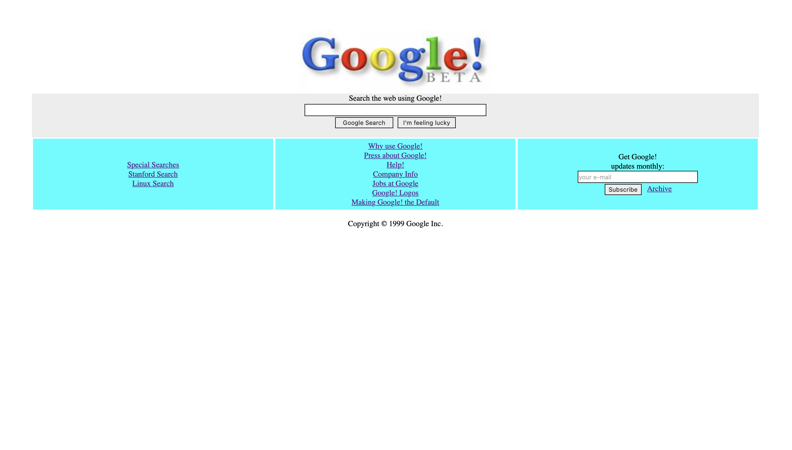

# CSS İkinci Ödev
[Kodluyoruz](https://www.kodluyoruz.org) CSS'in ikinci ödevidir.
* Google 1998 Kopyası HTML-CSS yardımıyla yapılmıştır.

## Installation
```bash
git clone https://github.com/hkaya15/Kodluyoruz_Web_Development_Elementary.git
```
## License 
[MIT](https://choosealicense.com/licenses/mit/)